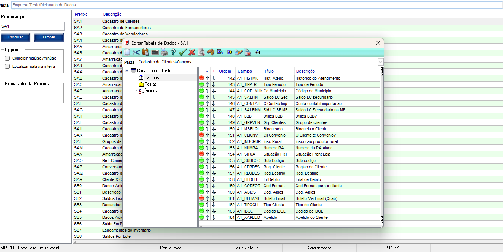

# Exercício 4 - Campo Customizado na SA1

## Objetivo

Criar um campo customizado na tabela SA1 (Cadastro de Clientes) utilizando o Configurador do Protheus.

## Desenvolvimento

Foi acessado o Configurador (SIGACFG) e aberta a tabela **SA1** no Dicionário de Dados.

Em seguida, foi criado o campo customizado **A1_XAPELID**, definindo seu tipo, tamanho e demais informações necessárias.

Após salvar a alteração, o campo passou a fazer parte da estrutura da tabela SA1, ficando disponível para utilização no sistema sem a necessidade de criar uma rotina ADVPL.

## Evidência

